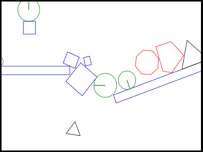

##### Rigid Body

Rigid Body is an implementation of a 2D game engine based on the book "Introduction to 2D Game Physics Engine Development".

The physics engine works like a world, consisting of rigid bodies, being simulated in an infinite loop, advancing in time by some interval in each iteration. In each iteration, forces act on the bodies, determining their acceleration and changing the velocity, leading to collisions; these are then resolved by adding restriction impulses and, finally, the new body positions and orientations are calculated.

## Screen

